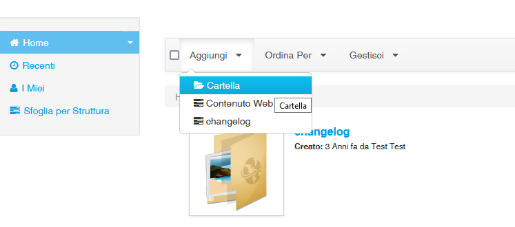
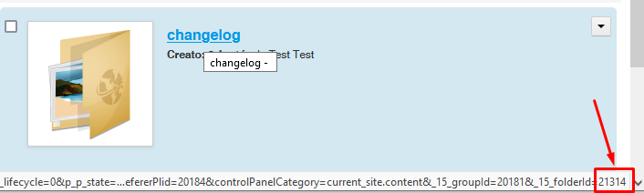
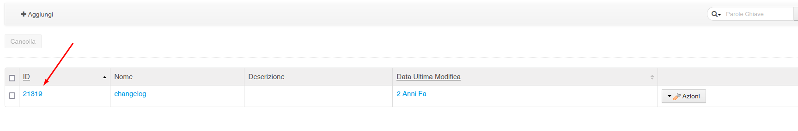
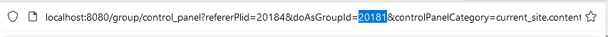
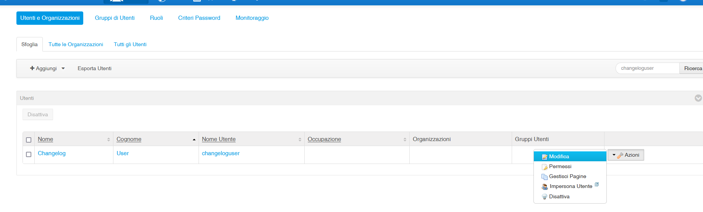
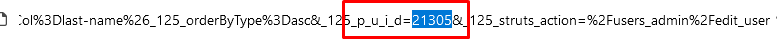
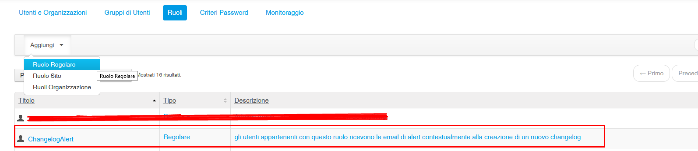
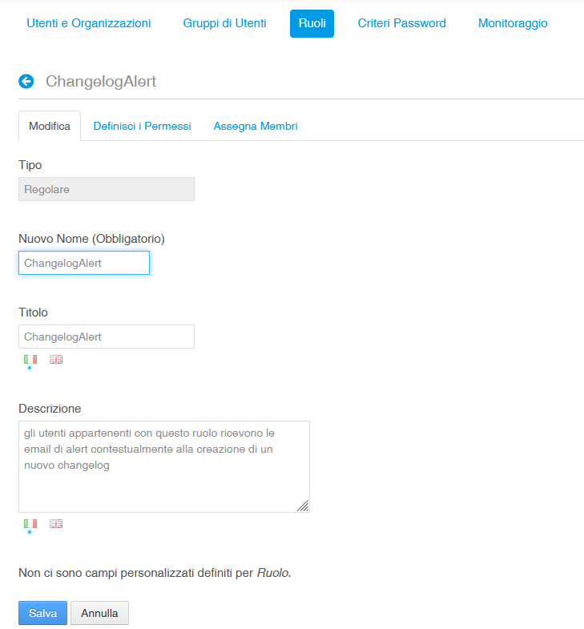

# Servizio Terminologico Integrato (Portale) 

### Nome del modulo: sti-cts2-portlets-build


## Modulo maven pricipale contenente i sorgenti delle portlet del portale

##  https://sti.iit.cnr.it


[Website](https://sti.iit.cnr.it )


### Descrizione

Il progetto è finalizzato a fornire un servizio terminologico integrato in ambito sanitario, di supporto alle Regioni e alle Province Autonome per la gestione e l’utilizzo dei sistemi di codifica previsti nell’ambito del FSE. 
La piattaforma consente di integrare, normalizzare ed indicizzare le informazioni riguardanti diagnosi e sintomi, procedure, misure, osservazioni cliniche, principi attivi e farmaci, presenti in sistemi di codifica nazionali e internazionali.
La piattaforma lato utente consente di importare, indicizzare, fruire (ricercare e navigare), e gestire, secondo le specifiche del protocollo HL7 CTS-2, le informazioni concettuali e semantiche contenute in sistemi di codifica standard utilizzati a livello nazionale (es. LOINC, ICD9-CM, AIC e ATC), in sistemi di codifica utilizzati a livello locale o regionale, nonché in value set e mappature, utili ai fini del loro utilizzo nell’ambito del Fascicolo Sanitario Elettronico, effettuare l’esportazione dei dati, effettuare query di tipo semantico, mantenere il versioning delle risorse, e facilitare l’editing di mapping tra le diverse codifiche. 

Per maggiori dettagli sulle funzionalità di STI è possibile scaricare il **manuale utente** al seguente link:
http://cosenza.iit.cnr.it/repo/sti/dati_base/docs/STI_Manuale_Utente.pdf

I moduli di progetto sono suddivisi in repository e vanno scaricati e configurati nel seguente ordine:

https://github.com/iit-rende/sti-cts2-framework (repo attuale)

https://github.com/iit-rende/sti-service

https://github.com/iit-rende/sti-cts2-portlets-build


### Descrizione Repository
Questo repository contiene il modulo parent **sti-cts2-portlets-build** e i seguenti moduli figli

- Nel repository è presente la cartella "cts2-portlets-build\extra\adt strutture e templates" contenente la struttura dati ed il template Liferay da applicare ai dati gestiti per quanto riguarda il changelog sulle codifiche. Quindi Dopo aver avviato Liferay servirà creare una Struttura e un Template utilizzando il codice contenuto nel file indicati. Per maggiori dettagli vedere la sezione "Configurazione Ambiente"

  


- **gestione-portlet** [Portlet liferay per la gestione/importazione delle codifiche] 
	
	 La parte front-end della portlet è scritta in vue.js
	
	La parte di gestione codifiche permette il caricamento dei dati (sistemi di codifica, value set, file di mapping) attraverso gli appositi tab e template, l’editing di mappature tra due sistemi di codifica, ovvero la possibilità che, una volta caricate, 2 o più codifiche sia possibile correlarle tra loro tramite relazioni di equivalenza, sinonimia o altro tipo di associazione.  È possibile, inoltre, per utenti amministratori, approvare le mappature editate tramite la piattaforma.  Sono disponibili anche le funzionalità di eliminazione di una risorsa.
	
	
	
	


- **search-portlet** [Portlet liferay per la ricerca e visualizzazione delle codifiche importate] 
	
	La parte front-end della portlet è scritta in vue.js
	
	La ricerca sulle codifiche memorizzate a sistema viene effettuata in modalità Full Text, ovvero scrivendo in una apposita area di ricerca un termine, un testo o un codice.
	È inoltre possibile filtrare la ricerca, limitandola ad un singolo sistema di codifica oppure ricercare su più o su tutte le codifiche contemporaneamente. Nel caso di ricerca su un singolo sistema di codifica, è possibile applicare dei filtri specifici (ricerca avanzata) su uno o più campi della struttura dati (ove previsto dal punto di vista funzionale). Sono disponibili anche le funzionalità di export delle risorse caricate nei formati JSON o CSV.
	
	
	
	


Sviluppo Frontend (valido per entrambe le portlet sopraelencate)
=================

Per velocizzare lo sviluppo è stato pensato di creare un piccolo ambiente che migliora l'esperienza dello sviluppatore e quindi ne minimizza le perdite di tempo.

Installazione
-------------

Eseguire i seguenti passi:

* installare [node.js](https://nodejs.org/it/download/);
* eseguire da linea di comando `npm install`.

Esecuzione
----------

Lanciare il comando `grunt serve` per eseguire il server e sviluppare nel modo più veloce possibile. L'applicazione sarà accessibile su [localhost:8000](http://localhost:8000/) e le modifiche eseguite saranno rese immediatamente disponibili, senza la necessità di effettuare il deploy.
È importante notare che il server `Liferay` dovrà comunque essere avviato.
È necessario [lanciare il browser in modalità non sicura](http://stackoverflow.com/a/3177718)  in modo da non effettuare controlli sul CORS.

Informazioni aggiuntive
-----------------------

#### Come funziona questo ambiente?

L'ambiente sfrutta il task runner [Grunt](http://gruntjs.com/). È stato definito il task `serve` che effettua due operazioni:

* fa partire un server che serve staticamente il contenuto della cartella `dist`;
* effettua il `watch` sulle cartelle `resources` e `views`.

Il comando `watch` a sua volta lancia una serie di task:

* `copy`: copia tutto ciò che c'è nella cartella `resources` nella cartella `dist`;

* `convert`: converte il contenuto di `liferay-portlet.xml` in JSON e lo salva nella cartella `dist` con il nome `liferay-portlet-json`;

* `indexhtmlwriter`: carica nella configurazione del task successivo dei dati importanti che includono: tutti i `JavaScript`, i `CSS` e il contenuto del file `view.jsp`;

* `template`: processa il template e i dati passati dal task precedente e crea il file `index.html`, posizionandolo nella cartella `dist`.

* file di configurazione ...-portlet\src\main\webapp\Gruntfile.js

  


#### Cosa committare

**Non** bisogna assolutamente committare la cartella `dist` e `node_modules`; la prima perchè è generata in fase di sviluppo, mentre la seconda perchè è la cartella che contiene tutte le librerie utilizzate in fase di sviluppo per lanciare il comando `grunt`.


## Prerequisiti

Prima di procedere al download dei sorgenti per il corretto funzionamento occorre installare le seguenti componenti applicative.
Per la loro installazione si demanda alla documentazione ufficiale

- SO AlmaLinuxOS [https://almalinux.org/it/]
- JDK 1.8 [https://www.oracle.com/it/java/technologies/javase/javase8-archive-downloads.html]
- Maven 3.6.3 [https://maven.apache.org/docs/3.6.3/release-notes.html] 
- Postgres 9.6 [https://www.postgresql.org/ftp/source/]
- liferay-portal-6.2-ce-ga6 [https://sourceforge.net/projects/lportal/files/Liferay%20Portal/6.2.5%20GA6/]
- solr-6.3.0 [https://archive.apache.org/dist/lucene/solr/]
- Pentaho Data Integration: pdi-ce-5.4.0.1-130 [https://sourceforge.net/projects/pentaho/files/Data%20Integration/5.4/]
- Virtuoso 7.2 [http://vos.openlinksw.com/owiki/wiki/VOS/VOSDownload]
- sti-cts2-framework [https://github.com/iit-rende/sti-cts2-framework]
- sti-service [https://github.com/iit-rende/sti-service]


## Installazione 
Per procedere alla corretta installazione dei moduli del presente repository è necessario prima scaricare, configurare e distribuire (effettuare il deployment) i moduli dei repository [**sti-cts2-framework** e sti-service]
Per l'installazione degli applicativi [AlmaLinuxOS, JDK 1.8, Postgres 9.6, liferay-portal-6.2-ce-ga6, solr-6.3.0] si rimanda alla documentazione ufficiale.
Per quanto riguarda [**cts2 framework, sti-service**] l'installazione è descritta nei file readme dei repository di riferimento.


## Configurazione Ambiente

Nel file PATH_LIFERAY/liferay-portal-6.2-ce-ga6/tomcat-7.0.62/bin/setenv.sh va configurato il path del file di proprietà dell'applicativo con la seguente istruzione

**export STI_CTS2_CONFIG="/PATH/configurazione/sti-cts2.properties"**

Un template del file di prop è presente nel repository **..cts2-portlets-build\extra\config\sti-dev.properties**

​	

- **proprietà**: le proprietà da settare nel file sono le seguenti (i valori sono puramente di test)

```sh
# CONNESSIONE AL DATABASE
db.sti.server.address=jdbc:postgresql://localhost/sti_service
db.sti.username=
db.sti.password=

# BASE URL PER LE RISORSE
cts2.sti.server.address=http://localhost:8080
cts2.sti.solr.address=http://localhost:8983/solr
virtuoso.server.address=http://localhost

# TABELLE TEMPORANEE ETL PER IMPORT
cts2.sti.import.address=jdbc:postgresql://localhost/sti_import
cts2.sti.import.username=
cts2.sti.import.password=

filesystem.import.base.path=/opt/sti/TEMP_IMPORT
filesystem.export.base.path=/opt/sti/TEMP_EXPORT

etl.execution.loinc.enable=true
etl.execution.atc-aic.enable=true

#il valore va recuperato da liferay
sti.group.id=


#Changelog: i valori di [sti.changelog.user.id, sti.changelog.folder.id, sti.changelog.structure.id vanno recuperato da liferay dopo aver creato gli elementi]
sti.changelog.user.id=
sti.changelog.folder.id=
sti.changelog.structure.id=
sti.changelog.role.alert.name=ChangelogAlert
# per la prop sti.changelog.page.name indicare il l'ultimo elemento del "Friendly URL" della pagina in cui sono posizionati i dati
sti.changelog.page.name=history-aggiornamento
sti.changelog.email.subject=STI: Nuovo Aggiornamento

#Email
#sti.mail.active accept (true, OR false) 
sti.mail.active=false
sti.mail.smtp.host=
sti.mail.smtp.port=25
sti.mail.username=
sti.mail.password=
sti.mail.from.default=test@test.it
sti.mail.name.from.default=Servizio Terminologico Integrato


# KITCHEN
kitchen.executable.path=/home/pdi-ce-5.4.0.1-130/data-integration/kitchen.sh
kitchen.job.loinc=/opt/sti/ETL/Trasformazioni_kettle/LOINC_definitivo/POPOLA_LOINC.kjb
kitchen.job.aic=/opt/sti/ETL/Trasformazioni_kettle/ATC_AIC/POPOLA_AIC.kjb
kitchen.job.atc=/opt/sti/ETL/Trasformazioni_kettle/ATC_AIC/POPOLA_ATC.kjb
kitchen.job.mapping.atc.aic=/opt/sti/ETL/Trasformazioni_kettle/ATC_AIC/POPOLA_FARMACI_EQUIVALENTI_MAPPING_ATC_AIC.kjb

```


- **Liferay**: Dopo aver installato Liferay è necessario creare la folder "**changelog**" e la struttura con il relativo template che verranno applicati ai web content visibili nella pagina "History - Aggiornamento" del portale. In questa sezione verranno riportati i log delle attività svolte sulle codifiche (Importazione )

Di seguito la screenshot lato pannello di controllo per l'aggiunta/modifica della folder e della strutture e template e la screenshot della configurazione lato frontend per la visualizzazione dei contenuti web di liferay





La folder e la struttura creata vengono usato dal sistema per a gestione e visualizzazione delle informazioni di changelog. Gli id di queste 2 componenti vanno settate nel file di prop visto in precedenza. 

Le prop di riferimento sono "**sti.changelog.folder.id**" e "**sti.changelog.structure.id**"

il folderId si può recuperare direttamente dalla url visualizzata passando il mause sopra la folder appena creata




mentre per lo structureId si può recuperare direttamente dalla lista delle strutture su Liferay





Una volta definita la struttura e il modello va creata una pagina su liferay e successivamente va posizionato in pagina la componente "Aggregatore Risorse". Per la corretta visualizzazione dei web content va configurata nel seguente modo 

Tipo Risorsa: Contenuto Web

Sottotipo Contenuto Web: selezionare la struttura creata al punto precedente [changelog ]


Successivamente vanno deployare le portlet e posizionate in pagina.


Di seguito viene descritto come recuperare i valori per le prop "**sti.group.id**" e "**sti.changelog.user.id**"


Il valore per la prop "**sti.group.id**" si può recuperare dalla url generata da liferay accedendo al pannello di controllo come nella screen seguente




il valore per la prop "sti.changelog.user.id" si può recuperare dalla url che viene generata da lifeary in caso di modifica di un utente.

Quindi dovrà essere creato un utente ad esempio "changeloguser" al quale assegneremo il ruolo "**ChangelogAlert**" (che andremo a creare di seguito) ed entrando in edit si potrà recuperare il valore relativo all'id utente








Al passo successivo va creato un ruolo su Liferay da assegnare agli utenti che dovranno ricevere un alert (email) ogni volta che viene effettuata una modifica e quindi viene generato un nuovo changelog.

Il Ruolo da creare è "**ChangelogAlert**" come definito nelle screen seguenti e va associato all'utente precedentemente creato








- ETL:  Per il corretto funzionamento dell'applicativo bisogna configurare anche "Pentaho Data Integration". Quindi va scaricato PDI e vanno configurate correttamente le proprietà relative a "# KITCHEN", dove va indicata la home di PDI e il path delle trasformazioni che si occupano di inserire i dati in ambiente di stagin in fase di importazione. **[I sorgenti delle trasformazioni sono sotto la cartella "..\extra\ETL\Trasformazioni_kettle"] **

  Dopo aver scaricato ed installato PDI bisogna settare le prop che verranno utilizzate dalle trasformazioni

  La location del file di properties per kettle su sistema linux è di default è "/home/USERNAME/.kettle/**kettle.properties**" 

  Nel File vanno settate le seguenti prop per la connessione al DB di staging

  

  HOST_NAME = localhost			
  DATABASE_NAME = sti_import
  PORT_NUMBER =  5432					
  DB_USER = ***						 
  DB_PASSWORD = 	
  
  ​		

**Configurazione download codifiche**: la proprietà *filesystem.export.base.path* indica la folder dove vengono generati i file che possono essere scaricati dalla piattaforma a seguito di un importazione.  

In fase di configurazione della piattaforma per poter scaricare i file relativi al dump del DB e di SOLR è importante scaricare e posizionare all'interno della folder indicata dalla proprietà *filesystem.export.base.path*  (TEMP_EXPORT)  il contenuto scaricabile al seguente link:
http://cosenza.iit.cnr.it/repo/sti/dati_base/TEMP_EXPORT.zip
contenente i file relativi alle codifiche.

## Build

Per la build del modulo è necessario scaricare e installare - Maven 3.6.3 [https://maven.apache.org/docs/3.6.3/release-notes.html] o superiore

A questo punto si può considerare l'ambiente configurato e con liferay correttamente avviato. 
Per la build i comandi da lanciare sono i seguenti

```sh
git clone https://github.com/iit-rende/sti-cts2-portlets-build.git
cd cts2-portlets-build
mvn clean install
```


## Deploy

Una volta eseguita la build dei moduli bisognerà effettuare il deployment dei 2 war generati sotto ..**.liferay/deploy**  e le 2 portlet saranno pronte per essere utilizzate sul portale Liferay


## Virtuoso

Per l'installazione di virtuoso fare riferimento al seguente link http://wikis.openlinksw.com/VirtuosoWikiWeb/VirtuosoInstallUnixPE

Dalla URL http://cosenza.iit.cnr.it/repo/sti/dati_base/dump_virtuoso.zip, è possibile scaricare il dump di virtuoso che verrà utilizzato nella procedura di import.

Per quanto riguarda virtuoso bisogna importare il DB attraverso la seguente procedura:

collegarsi a virtuoso al seguente link http://URL_VIRTUOSO/conductor/ ed eseguire i seguenti passaggi


1. Arrestare il server Virtuoso

2. Copiare il file virtuoso.db dalla cartella db del server Virtuoso in una posizione di backup

3. Eliminare il file virtuoso.db.

4. Dal Terminale accedere alla posizione della cartella db del server Virtuoso dove troveremo i file *.bp

5. Digitare il seguente comando nel Terminale: **virtuoso-t +restore-backup prefix***

6. Una volta terminato il processo, avvia il server Virtuoso. 

*****il valore per **prefix** è **test** (questo valore è stato usato la creazione del dump del DB)


Il seguente link contiene la prcedura completa di import ed export del DB su virtuoso:

http://dhevasenapathi.blogspot.com/2013/09/backup-and-restoring-of-virtuoso.html


## Infrastruttura generale


## Copyright ©
 [TODO]

## Maintainer
 [TODO]


## License 
 [TODO]
**http://www.apache.org/licenses/LICENSE-2.0**
