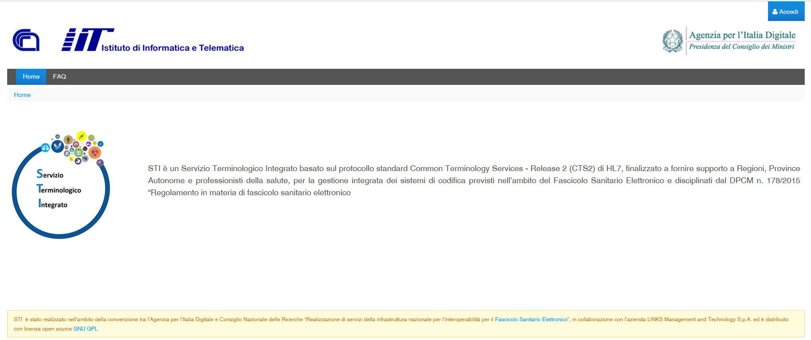
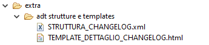
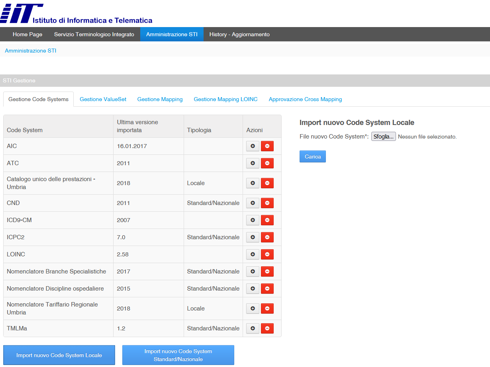
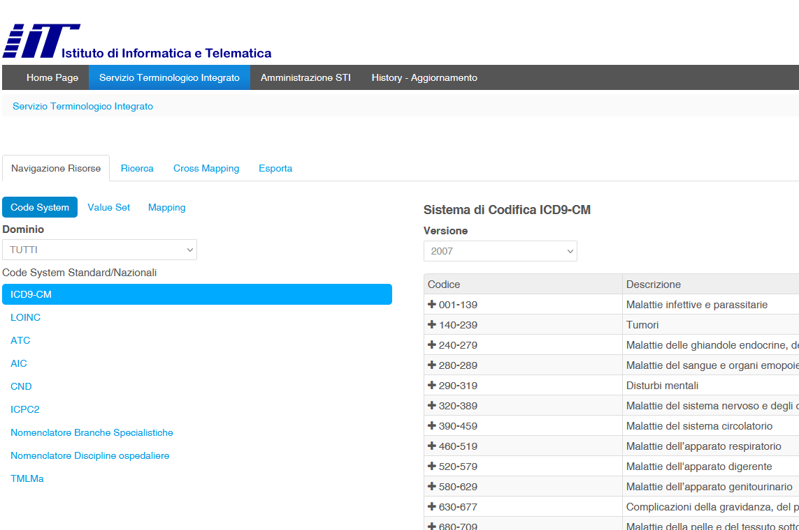
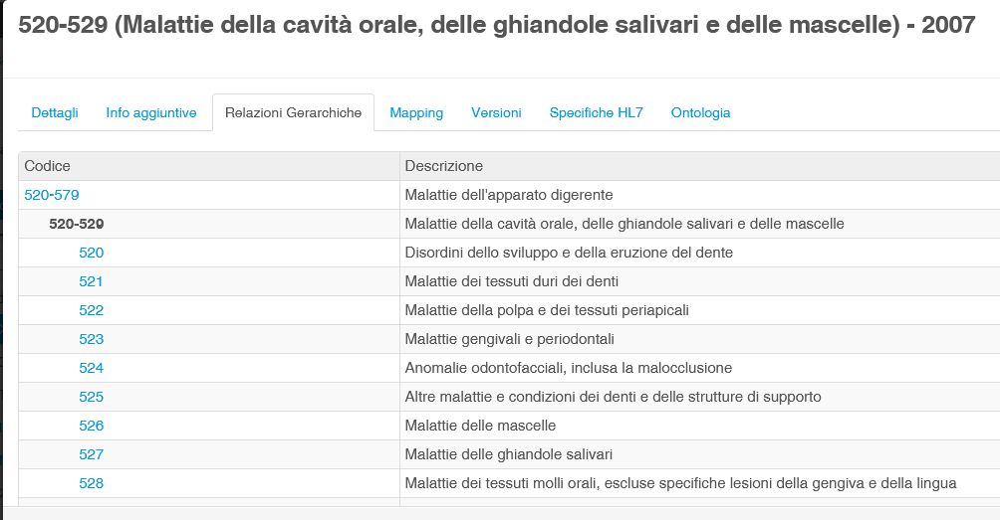
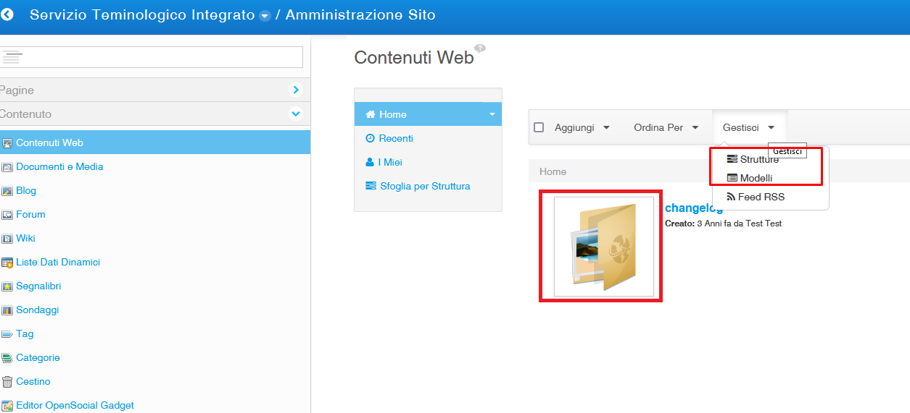
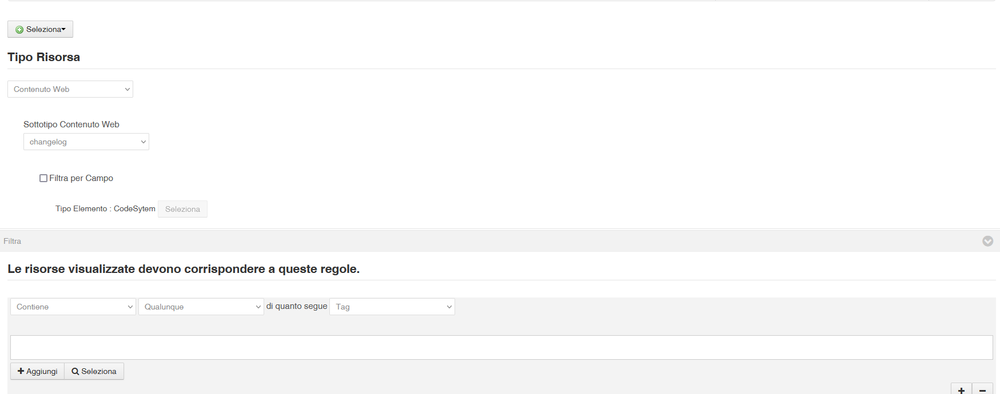
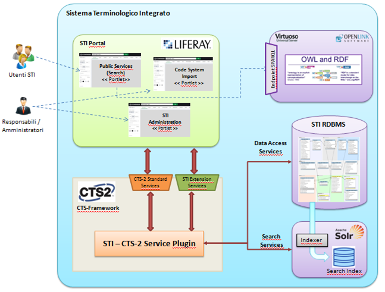

# Servizio Terminologico Integrato (Portale) 

### Nome del modulo: sti-cts2-portlets-build


## Modulo maven pricipale contenente i sorgenti delle portlet del portale

##  https://sti.iit.cnr.it


[Website](https://sti.iit.cnr.it )





### Descrizione

Il progetto è finalizzato a fornire un servizio terminologico integrato in ambito sanitario, di supporto alle Regioni e alle Province Autonome per la gestione e l’utilizzo dei sistemi di codifica previsti nell’ambito del FSE. 
La piattaforma consente di integrare, normalizzare ed indicizzare le informazioni riguardanti diagnosi e sintomi, procedure, misure, osservazioni cliniche, principi attivi e farmaci, presenti in sistemi di codifica nazionali e internazionali.
La piattaforma lato utente consente di importare, indicizzare, fruire (ricercare e navigare), e gestire, secondo le specifiche del protocollo HL7 CTS-2, le informazioni concettuali e semantiche contenute nei sistemi di codifica LOINC, ICD9-CM, AIC e ATC, nonché nei value set messi a disposizione dal committente, effettuare l’esportazione dei dati, effettuare query di tipo semantico, mantenere il versioning delle risorse, e facilitare il mapping tra le diverse codifiche.


### Descrizione Repository
Questo repository contiene il modulo parent **sti-cts2-portlets-build** e i seguenti moduli child

- Nel repository è presente la folder "cts2-portlets-build\extra\adt strutture e templates" contenente la struttura dati ed il template Liferay da applicare ai dati gestiti per quanto riguarda il changelog sulle codifiche. Quindi Dopo aver avviato Liferay servirà creare una Struttura e un Template utilizzando il codice contenuto nel file indicati. Per maggiori dettagli vedere la sezione "Configurazione Ambiente"

  




- gestione-portlet [Portlet liferay per la gestione/importazione delle codifiche] 
	
	 La parte FE della portlet è scritta in vue.js
	
	La portlet di gestione codifiche permette il caricamento dei dati attraverso gli appositi tab e il mapping tra codifiche, ovvero la possibilità che una volta caricate 2 o più codifiche sia possibile collegarle tra loro attraverso dei campi in comune
	
	
	
	


- search-portlet [Portlet liferay per la ricerca e visualizzazione delle codifiche importate] 
	
	La parte FE della portlet è scritta in vue.js
	
	La ricerca sulle codifiche memorizzate nel sistema viene effettuata in modalità Full Text, ovvero scrivendo in una apposita area di ricerca un termine, un testo o un codice.
	E’ inoltre possibile filtrare la ricerca, limitandola ad un singolo sistema di codifica oppure ricercare su più codifiche contemporaneamente. 
	
	Nel caso di ricerca su un singolo sistema di codifica, è possibile applicare dei filtri specifici su uno o più campi della struttura dati (ove previsto dal punto di vista funzionale).
	
	
	
	





Sviluppo Frontend (valido per entrambe le portlet)
=================

Per velocizzare lo sviluppo è stato pensato di creare un piccolo ambiente che migliora l'esperienza dello sviluppatore e quindi ne minimizza le perdite di tempo.

Installazione
-------------

Eseguire i seguenti passi:

* installare [Node](https://nodejs.org/it/download/);
* eseguire da linea di comando `npm install`.

Esecuzione
----------

Lanciare il comando `grunt serve` per eseguire il server e sviluppare nel modo più veloce possibile. L'applicazione sarà accessibile su [localhost:8000](http://localhost:8000/) e le modifiche fatte saranno rese immediatamente disponibili, senza la necessità di effettuare il deploy.
È importante notare che il server `Liferay` dovrà comunque essere avviato.
È necessario [lanciare il browser in modalità non sicura](http://stackoverflow.com/a/3177718) che non fa controlli sul CORS.

Informazioni aggiuntive
-----------------------

#### Come funziona questo ambiente?

L'ambiente sfrutta il task runner [Grunt](http://gruntjs.com/). È stato definito il task `serve` che effettua due operazioni:

* fa partire un server che serve staticamente il contenuto della cartella `dist`;
* effettua il `watch` sulle cartelle `resources` e `views`.

Il comando `watch` a sua volta lancia una serie di task:

* `copy`: copia tutto ciò che c'è nella cartella `resources` nella cartella `dist`;

* `convert`: converte il contenuto di `liferay-portlet.xml` in JSON e lo salva nella cartella `dist` con il nome `liferay-portlet-json`;

* `indexhtmlwriter`: carica nella configurazione del task successivo dei dati importanti che includono: tutti i `JavaScript`, i `CSS` e il contenuto del file `view.jsp`;

* `template`: processa il template e i dati passati dal task precedente e crea il file `index.html`, posizionandolo nella cartella `dist`.

* file di configurazione ...-portlet\src\main\webapp\Gruntfile.js

  


#### Cosa committare

**Non** bisogna assolutamente committare la cartella `dist` e `node_modules`; la prima perchè è generata in fase di sviluppo, mentre la seconda perchè è la cartella che contiene tutte le librerie utilizzate in fase di sviluppo per lanciare il comando `grunt`.


## Prerequisiti

Prima di procedere al download dei sorgenti per il corretto funzionamento occorre installare le seguenti.
Per l'installazione degli applicativi si demanda alla documentazione ufficiale

- SO AlmaLinuxOS [https://almalinux.org/it/]
- JDK 1.8 [https://www.oracle.com/it/java/technologies/javase/javase8-archive-downloads.html]
- Maven 3.6.3 [https://maven.apache.org/docs/3.6.3/release-notes.html] 
- Postgres 9.6 [https://www.postgresql.org/ftp/source/]
- liferay-portal-6.2-ce-ga6 [https://sourceforge.net/projects/lportal/files/Liferay%20Portal/6.2.5%20GA6/]
- solr-6.3.0 [https://archive.apache.org/dist/lucene/solr/]
- Pentaho Data Integration: pdi-ce-5.4.0.1-130 [https://sourceforge.net/projects/pentaho/files/Data%20Integration/5.4/]
- Virtuoso 07.20.3233
- sti-cts2-framework-1.2.0.FINAL [https://github.com/iit-rende/sti-cts2-framework]
- sti-service [https://github.com/iit-rende/sti-service]


## Installazione 
Per procedere alla corretta installazione dei moduli del presente repository è necessario prima scaricare configurare e deployare i moduli dei repository [**sti-cts2-framework-1.2.0.FINAL** e **sti-service**]
Per l'installazione degli applicativi [AlmaLinuxOS, JDK 1.8, Postgres 9.6, liferay-portal-6.2-ce-ga6,solr-6.3.0] si rimanda alla documentazione ufficiale.
Per quanto riguarda [**framework cts2, sti-service**] l'installazione è descritta nei repository di riferimento.


## Configurazione Ambiente

nel file PATH_LIFERAY/liferay-portal-6.2-ce-ga6/tomcat-7.0.62/bin/setenv.sh va configurato il path del file di prop dell'applicativo con la seguente istruzione

**export STI_CTS2_CONFIG="/PATH/configurazione/sti-cts2.properties"**

Un template del file di prop è presente nel repository **..cts2-portlets-build\extra\config\sti-dev.properties**

​	

- **proprietà**: le proprietà da settare nel file sono le seguenti (i valori sono puramente di test)

```sh
# CONNESSIONE AL DATABASE
db.sti.server.address=jdbc:postgresql://localhost/sti_service
db.sti.username=
db.sti.password=

# BASE URL PER LE RISORSE
cts2.sti.server.address=http://localhost:8080
cts2.sti.solr.address=http://localhost:8983/solr
virtuoso.server.address=http://localhost

# TABELLE TEMPORANEE ETL PER IMPORT
cts2.sti.import.address=jdbc:postgresql://localhost/sti_import
cts2.sti.import.username=
cts2.sti.import.password=

filesystem.import.base.path=/opt/sti/TEMP_IMPORT
filesystem.export.base.path=/opt/sti/TEMP_EXPORT

etl.execution.loinc.enable=true
etl.execution.atc-aic.enable=true

#il valore va recuperato da liferay
sti.group.id=


#Changelog: i valori di [sti.changelog.user.id, sti.changelog.folder.id, sti.changelog.structure.id vanno recuperato da liferay dopo aver creato gli elementi]
sti.changelog.user.id=
sti.changelog.folder.id=
sti.changelog.structure.id=
sti.changelog.role.alert.name=ChangelogAlert
# per la prop sti.changelog.page.name indicare il l'ultimo elemento del "Friendly URL" della pagina in cui sono posizionati i dati
sti.changelog.page.name=history-aggiornamento
sti.changelog.email.subject=STI: Nuovo Aggiornamento

#Email
#sti.mail.active accept (true, OR false) 
sti.mail.active=false
sti.mail.smtp.host=
sti.mail.smtp.port=25
sti.mail.username=
sti.mail.password=
sti.mail.from.default=test@test.it
sti.mail.name.from.default=Servizio Terminologico Integrato


# KITCHEN
kitchen.executable.path=/home/pdi-ce-5.4.0.1-130/data-integration/kitchen.sh
kitchen.job.loinc=/opt/sti/ETL/Trasformazioni_kettle/LOINC_definitivo/POPOLA_LOINC.kjb
kitchen.job.aic=/opt/sti/ETL/Trasformazioni_kettle/ATC_AIC/POPOLA_AIC.kjb
kitchen.job.atc=/opt/sti/ETL/Trasformazioni_kettle/ATC_AIC/POPOLA_ATC.kjb
kitchen.job.mapping.atc.aic=/opt/sti/ETL/Trasformazioni_kettle/ATC_AIC/POPOLA_FARMACI_EQUIVALENTI_MAPPING_ATC_AIC.kjb

```


- **Liferay**: Dopo aver installato Liferay è necessario creare la struttura e il template che verranno applicati ai web content visibili nella pagina "History - Aggiornamento" del portale. In questa sezione verranno riportati i log delle attività svolte sulle codifiche (Importazione )

Di seguito la screenshot lato pannello di controllo per l'aggiunta/modifica delle strutture e template e la screenshot della configurazione lato frontend per la visualizzazione dei contenuti web di liferay





Una volta definita la struttura e il modello va creata una pagina su liferay e successivamente va posizionato in pagina la componente "Aggregatore Risorse". Per la corretta visualizzazione dei web content va configurata nel seguente modo 

Tipo Risorsa: Contenuto Web

Sottotipo Contenuto Web: selezionare la struttura creata al punto precedente [changelog ]





Successivamente vanno deployare le portlet e posizionate in pagina.


- ETL:  Per il corretto funzionamento dell'applicativo bisogna configurare anche "Pentaho Data Integration". Quindi va scaricato PDI e vano configurate contentamente le prop relative a "# KITCHEN", dove va indicata la home di PDI e e il path delle trasformazioni che si occupano di inserire i dati in ambiente di stagin in fase di importazione. **[I sorgenti delle trasformazioni sono sotto "..\extra\ETL\Trasformazioni_kettle"] **

  Dopo scaricato ed installato PDI bisogna settare le prop che verranno utilizzate dalle trasformazioni

  la location del file di properties per kettle su sistema linux è di default è "/home/USERNAME/.kettle/**kettle.properties**" 

  nel File vanno settate le seguenti prop per la connessione al DB di staging

  

  HOST_NAME = localhost			
  DATABASE_NAME = sti_import
  PORT_NUMBER =  5432					
  DB_USER = ***						 
  DB_PASSWORD = 			


## Build

Per la build del modulo è necessario scaricare e installare - Maven 3.6.3 [https://maven.apache.org/docs/3.6.3/release-notes.html] o superiore

A questo punto si considera un ambiente configurato e con liferay correttamente avviato. 
Per la build i comandi da lanciare sono i seguenti (scaricare i sorgenti, entrare nella folder del progetto e lanciare il comando seguente per generale la build). La build è possibile lanciarla anche su uno solo dei sotto moduli (Portlet)

```sh
git clone https://...
cd cts2-portlets-build
mvn clean install
```


## Deploy

una volta buildato i modui bisognerà deployare i 2 war genearti sotto ..**.liferay/deploy** 
e le 2 portlet saranno pronte per essere utilizzate sul portale Liferay


## Infrastruttura generale





## Copyright ©
 [TODO]

## Maintainer
 [TODO]


## License 
 [TODO]
**http://www.apache.org/licenses/LICENSE-2.0**
